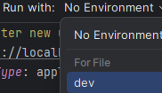

# score-play

Backend API for managing games, users, sessions and scores.

## Building & Running

| Task              | Description                      |
|-------------------|----------------------------------|
| `./gradlew test`  | Run the tests                    |
| `./gradlew build` | Build everything & run the tests |

Our integration tests run a full flow against the application, which requires a running database.

### Database

Use the Docker Compose file to start the database.
You need to use the `score_play.sql` script in `/resources` to create the schema.
Optionally, you can seed your database with some test data using the `mockdata.sql` script, also in `/resources`.

Running the application requires a running database.

You can run the application by running the resulting jar directly, or using `./gradlew run`

If the server starts successfully, you'll see the following output:

```
2024-12-04 14:32:45.584 [main] INFO  Application - Application started in w.xyz seconds.
2024-12-04 14:32:45.682 [main] INFO  Application - Responding at http://a.b.c.d:8080
```

**Assuming you are using IntelliJ IDEA:**
To start running requests, run the HTTP scripts in `src/main/resources/users/login.http`
to register a test user, and log in.

Then set the Environment to `dev` to be able to use the same authentication token for all requests.

